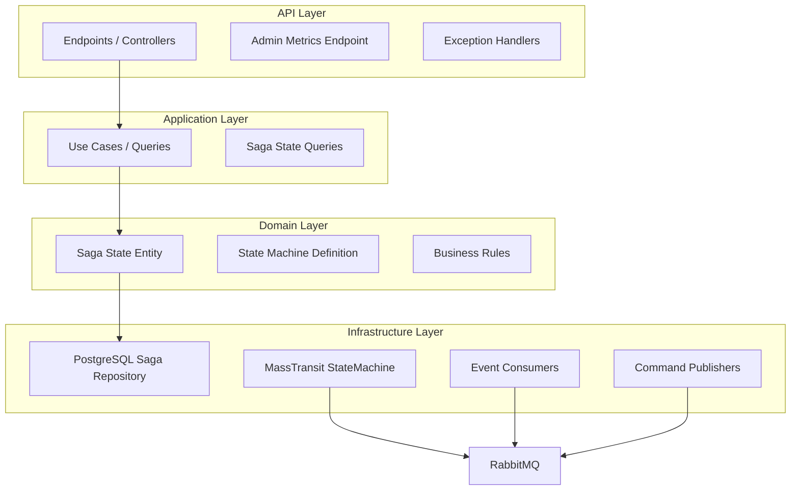
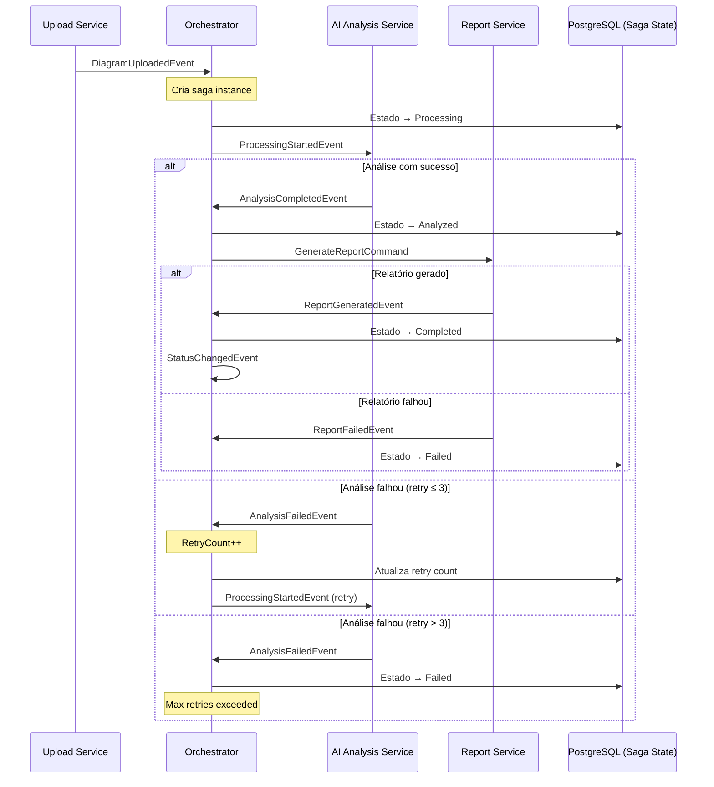
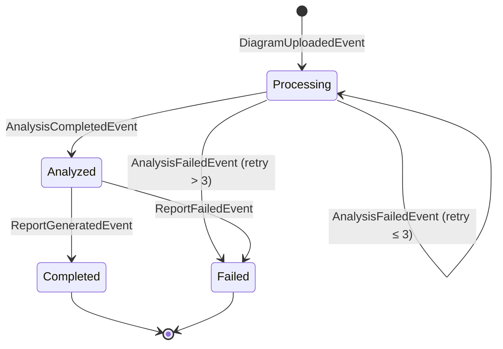
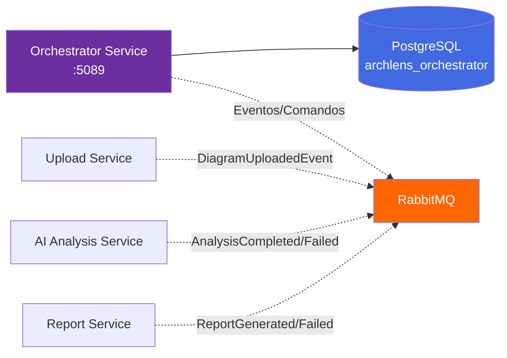
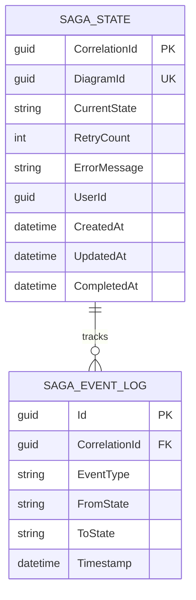
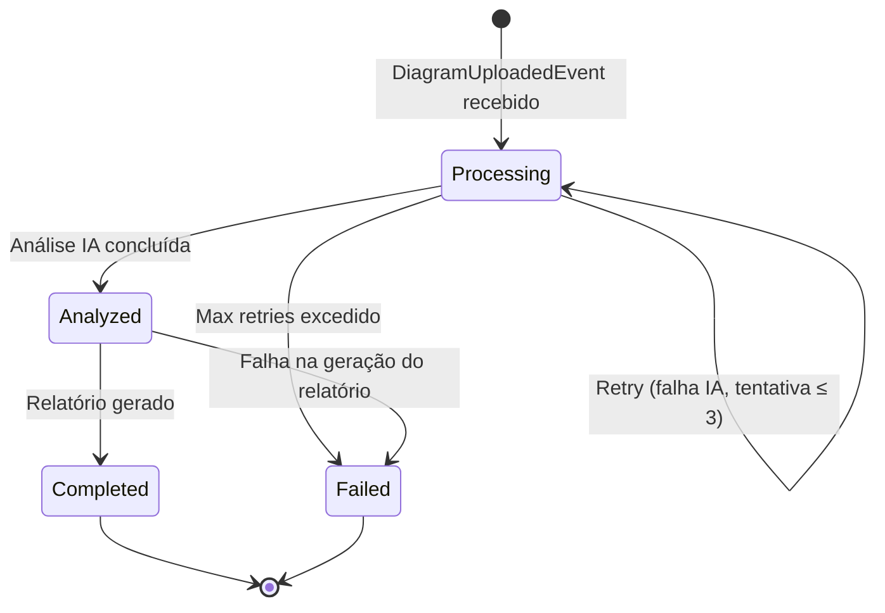
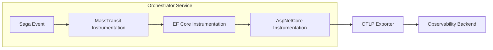

# ArchLens - Orchestrator Service

[](https://github.com/archlens-platform/archlens-orchestrator-service/actions/workflows/ci.yml)
[](https://sonarcloud.io/summary/new_code?id=archlens-platform_archlens-orchestrator-service)
[](https://sonarcloud.io/summary/new_code?id=archlens-platform_archlens-orchestrator-service)
[](https://sonarcloud.io/summary/new_code?id=archlens-platform_archlens-orchestrator-service)
[](https://sonarcloud.io/summary/new_code?id=archlens-platform_archlens-orchestrator-service)
[](https://sonarcloud.io/summary/new_code?id=archlens-platform_archlens-orchestrator-service)
[](https://sonarcloud.io/summary/new_code?id=archlens-platform_archlens-orchestrator-service)
[](https://sonarcloud.io/summary/new_code?id=archlens-platform_archlens-orchestrator-service)

> **Microsserviço Orquestrador de Saga para Análise de Diagramas com IA**
> Hackathon FIAP - Fase 5 | Pós-Tech Software Architecture + IA para Devs
>
> **Autor:** Rafael Henrique Barbosa Pereira (RM366243)

[](https://dotnet.microsoft.com/)
[](https://www.docker.com/)
[](https://blog.cleancoder.com/uncle-bob/2012/08/13/the-clean-architecture.html)
[](https://www.postgresql.org/)
[](https://www.rabbitmq.com/)
[](https://masstransit.io/)

## 📋 Descrição

O **Orchestrator Service** é o coração do fluxo de processamento do ArchLens. Implementa o padrão **Saga Orquestrada** utilizando **MassTransit StateMachine** para coordenar o pipeline completo de análise de diagramas arquiteturais — desde o upload até a geração do relatório final com IA. Gerencia estados, retentativas (máximo 3 em falhas de IA), e oferece endpoints de consulta de status e métricas administrativas para dashboard.

## 🏗️ Arquitetura

O projeto segue os princípios de **Clean Architecture**:



## 🔄 Saga StateMachine - Fluxo Completo

O Orchestrator coordena o pipeline de análise através de uma **State Machine** com estados bem definidos e tratamento de falhas:



### Diagrama de Estados da Saga



## 🛠️ Tecnologias

| Tecnologia | Versão | Descrição |
|------------|--------|-----------|
| .NET | 9.0 | Framework principal |
| PostgreSQL | 17 | Banco de dados relacional (saga state) |
| Entity Framework Core | 9.x | ORM para PostgreSQL |
| MassTransit | 8.x | Saga StateMachine + Message Broker |
| RabbitMQ | 3.x | Message Broker |
| OpenTelemetry | 1.x | Traces e Métricas |
| Serilog | 4.x | Logs Estruturados |
| Swagger/OpenAPI | 6.x | Documentação da API |

## 🔒 Isolamento de Banco de Dados

> ⚠️ **Requisito:** "Nenhum serviço pode acessar diretamente o banco de outro serviço."

Este serviço acessa **exclusivamente** seu próprio banco PostgreSQL (`archlens_orchestrator`), que armazena o estado da saga. A comunicação com todos os outros serviços é feita **apenas via RabbitMQ (eventos e comandos)**:



**Eventos publicados:** `ProcessingStartedEvent`, `GenerateReportCommand`, `StatusChangedEvent`
**Eventos consumidos:** `DiagramUploadedEvent`, `AnalysisCompletedEvent`, `AnalysisFailedEvent`, `ReportGeneratedEvent`, `ReportFailedEvent`

## 📁 Estrutura do Projeto

```
archlens-orchestrator-service/
├── src/
│   ├── ArchLens.Orchestrator.Api/              # API Layer
│   │   ├── Endpoints/                          # Minimal APIs
│   │   │   ├── SagaQueryEndpoints.cs           # Status queries
│   │   │   └── AdminMetricsEndpoints.cs        # Dashboard metrics
│   │   ├── Middlewares/                         # CorrelationId
│   │   └── Program.cs                          # Entry point (:5089)
│   │
│   ├── ArchLens.Orchestrator.Application/      # Application Layer
│   │   └── Queries/                            # Saga state queries
│   │
│   ├── ArchLens.Orchestrator.Domain/           # Domain Layer
│   │   ├── Entities/                           # SagaState
│   │   ├── StateMachine/                       # DiagramAnalysisSaga
│   │   └── Interfaces/                         # Contratos
│   │
│   └── ArchLens.Orchestrator.Infrastructure/   # Infrastructure Layer
│       ├── Persistence/                        # EF Core Saga Repository
│       ├── StateMachine/                       # MassTransit StateMachine Config
│       └── Messaging/                          # Consumers + Publishers
│
└── tests/
    └── ArchLens.Orchestrator.Tests/            # Testes unitários e integração
```

## 🚀 Como Executar

### Pré-requisitos
- .NET 9.0 SDK
- Docker (para PostgreSQL e RabbitMQ)

### Passos

```bash
# 1. Subir infraestrutura
docker-compose up -d postgres rabbitmq

# 2. Executar a API
dotnet run --project src/ArchLens.Orchestrator.Api
```

A API estará disponível em: `http://localhost:5089`

## 📡 Endpoints

### Consulta de Saga (`/saga`)

| Método | Endpoint | Auth | Descrição |
|--------|----------|------|-----------|
| GET | `/saga/diagram/{diagramId}` | 🔐 JWT | Consultar saga por diagram ID |
| GET | `/saga/{correlationId}` | 🔐 JWT | Consultar saga por correlation ID |
| GET | `/saga/admin/metrics` | 🔐 Admin | Métricas agregadas para dashboard |

### Exemplo de Resposta - Admin Metrics

O endpoint `/saga/admin/metrics` retorna métricas agregadas do pipeline:

```json
{
  "totalSagas": 150,
  "byStatus": {
    "Processing": 5,
    "Analyzed": 3,
    "Completed": 130,
    "Failed": 12
  },
  "averageProcessingTime": "00:02:35",
  "retryRate": 0.08,
  "successRate": 0.92
}
```

## 📊 Diagrama de Entidades



## 📈 Fluxo de Negócio



## 📨 Eventos do Saga

### Eventos Consumidos

| Evento | Origem | Ação |
|--------|--------|------|
| `DiagramUploadedEvent` | Upload Service | Cria saga, transiciona para Processing |
| `AnalysisCompletedEvent` | AI Analysis Service | Transiciona para Analyzed, envia GenerateReportCommand |
| `AnalysisFailedEvent` | AI Analysis Service | Retry (≤3) ou transiciona para Failed |
| `ReportGeneratedEvent` | Report Service | Transiciona para Completed |
| `ReportFailedEvent` | Report Service | Transiciona para Failed |

### Eventos Publicados

| Evento | Quando | Destino |
|--------|--------|---------|
| `ProcessingStartedEvent` | Saga criada ou retry | AI Analysis Service |
| `GenerateReportCommand` | Análise concluída com sucesso | Report Service |
| `StatusChangedEvent` | Qualquer mudança de estado | Broadcast (notificações) |

### Política de Retentativas

| Parâmetro | Valor |
|-----------|-------|
| Máximo de retries | 3 |
| Evento de retry | `AnalysisFailedEvent` |
| Ação após max retries | Transiciona para `Failed` |

## 🧪 Testes

```bash
# Rodar todos os testes
dotnet test

# Rodar com cobertura
dotnet test --collect:"XPlat Code Coverage" --settings coverlet.runsettings

# Testes de integração (requer Docker)
dotnet test --filter "Category=Integration"
```

## 🔧 Configuração

### Variáveis de Ambiente

| Variável | Descrição |
|----------|-----------|
| `ConnectionStrings__DefaultConnection` | String de conexão PostgreSQL (saga state) |
| `RabbitMQ__Host` | Host do RabbitMQ |
| `RabbitMQ__Username` | Usuário do RabbitMQ |
| `RabbitMQ__Password` | Senha do RabbitMQ |
| `Saga__MaxRetryCount` | Máximo de retentativas (padrão: 3) |
| `OpenTelemetry__Endpoint` | Endpoint do OTLP Exporter |

## 🐳 Docker

```bash
docker build -t archlens-orchestrator-service .
docker run -p 5089:8080 archlens-orchestrator-service
```

## 📈 Observabilidade

O serviço possui integração completa com **OpenTelemetry** e **Serilog** para observabilidade:



**Instrumentações:**
- `AspNetCore` - Traces de requisições HTTP (endpoints de consulta)
- `EntityFrameworkCore` - Traces de operações PostgreSQL (saga state)
- `MassTransit` - Traces de transições de estado e mensageria

**Métricas Customizadas:**
- `saga.instances.active` - Sagas em andamento
- `saga.transitions.total` - Total de transições de estado
- `saga.retries.total` - Total de retentativas
- `saga.duration.seconds` - Duração média do pipeline

### Serilog (Logs Estruturados)

```json
{
  "Timestamp": "2026-03-15T00:00:00Z",
  "Level": "Information",
  "MessageTemplate": "Saga {CorrelationId} transitioned from {FromState} to {ToState}",
  "Properties": {
    "CorrelationId": "abc-123",
    "DiagramId": "def-456",
    "FromState": "Processing",
    "ToState": "Analyzed",
    "RetryCount": 0,
    "ServiceName": "archlens-orchestrator-service"
  }
}
```

---

FIAP - Pós-Tech Software Architecture + IA para Devs | Fase 5 - Hackathon (12SOAT + 6IADT)
